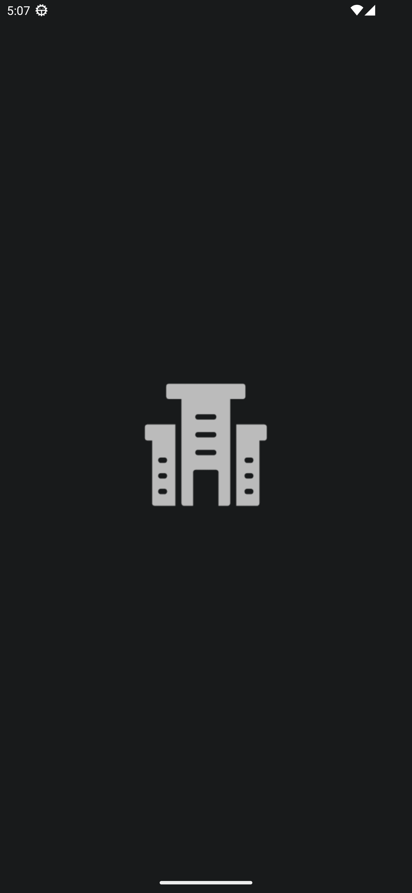
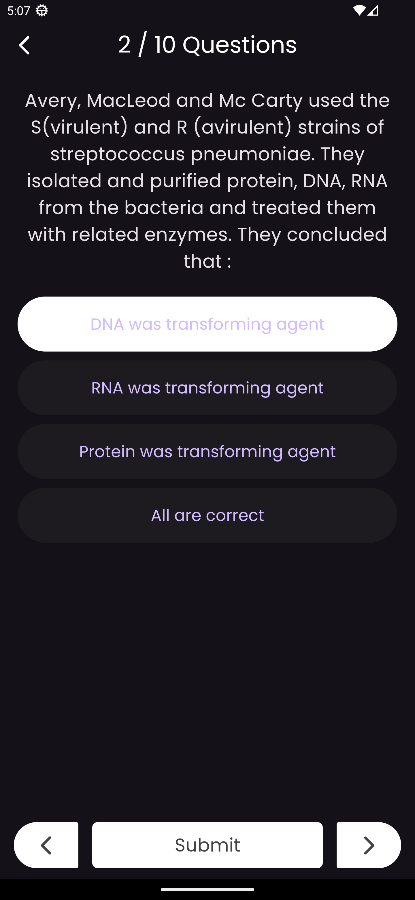
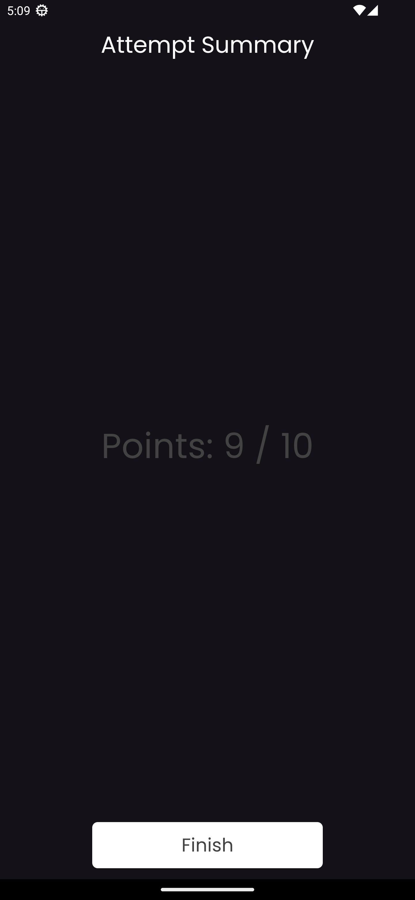

# Quiz App

This is a Flutter-based quiz application that allows users to take quizzes, select options, and view their scores. The app uses the `flutter_bloc` package for state management.

## Features

- Fetch quiz questions from a service.
- Display questions and options.
- Select options for each question.
- Navigate through questions using a `PageView`.
- View the score at the end of the quiz.

## Screenshots

<div style="display: flex; flex-wrap: wrap;">
    <div style="margin: 10px;">
        
        
        
        
</div>

## Project Structure

```
├── android/
├── assets/
├── build/
├── ios/
├── lib/
│   ├── data/
│   │   └── services/
│   ├── models/
│   │   └── question_model.dart
│   ├── ui/
│   │   ├── attempt_summary/
│   │   │   └── attempt_summary.dart
│   │   ├── quiz_question/
│   │   │   ├── quiz_question_cubit.dart
│   │   │   ├── quiz_question_screen.dart
│   │   │   ├── quiz_question_state.dart
│   │   │   └── quiz_question_state.freezed.dart
│   │   └── start_quiz/
│   │       └── start_quiz_screen.dart
│   └── main.dart
├── pubspec.lock
├── pubspec.yaml
├── LICENSE
└── README.md
```

## Getting Started

### Prerequisites

- Flutter SDK: [Install Flutter](https://flutter.dev/docs/get-started/install)
- Dart SDK: Comes with Flutter

### Installation

1. Clone the repository:
   ```sh
   git clone https://github.com/your-username/quiz-app.git
   cd quiz-app
   ```
2. Install dependencies:
   ```sh
   flutter pub get
   ```
3. Generate code using `build_runner` (required for `freezed`):
   ```sh
   dart run build_runner build --delete-conflicting-outputs
   ```
4. Run the app:
   ```sh
   flutter run
   ```

## Usage

1. Start the app.
2. Click on "Start Quiz" to begin.
3. Navigate through the questions and select your answers.
4. View your score at the end of the quiz.

## Code Overview

### Main Components

- **`main.dart`:** Entry point of the application.
- **`start_quiz_screen.dart`:** Screen to start the quiz.
- **`quiz_question_screen.dart`:** Screen to display quiz questions.
- **`quiz_question_cubit.dart`:** Cubit for managing quiz state.
- **`quiz_question_state.dart`:** State class for quiz questions.
- **`attempt_summary.dart`:** Screen to display the quiz attempt summary.

### Models

- **`question_model.dart`:** Model classes for questions and options.

### Services

- **`services.dart`:** Service class to fetch quiz questions.

## Contributing

Contributions are welcome! Please follow these steps:

1. Fork the repository.
2. Create a feature branch (`git checkout -b feature-name`).
3. Commit your changes (`git commit -m 'Add feature'`).
4. Push to the branch (`git push origin feature-name`).
5. Open a Pull Request.

## License

This project is licensed under the MIT License - see the [LICENSE](LICENSE) file for details.
